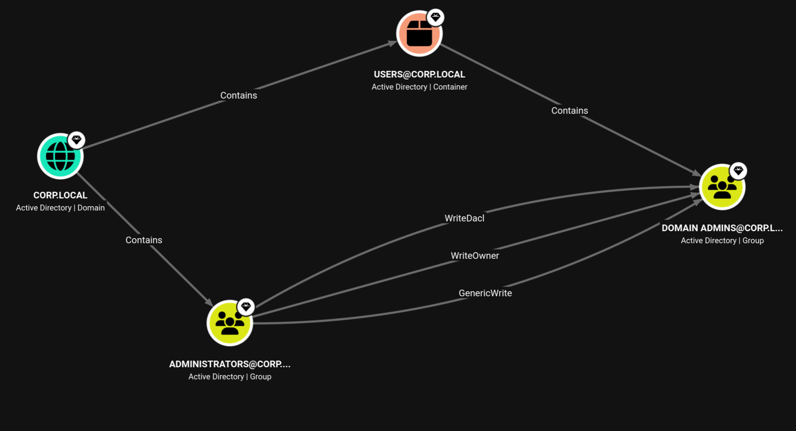
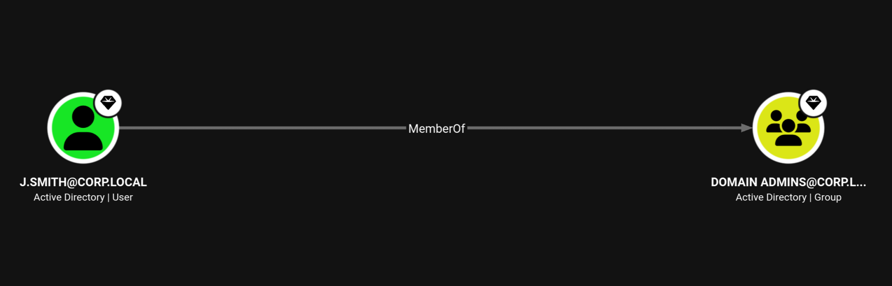
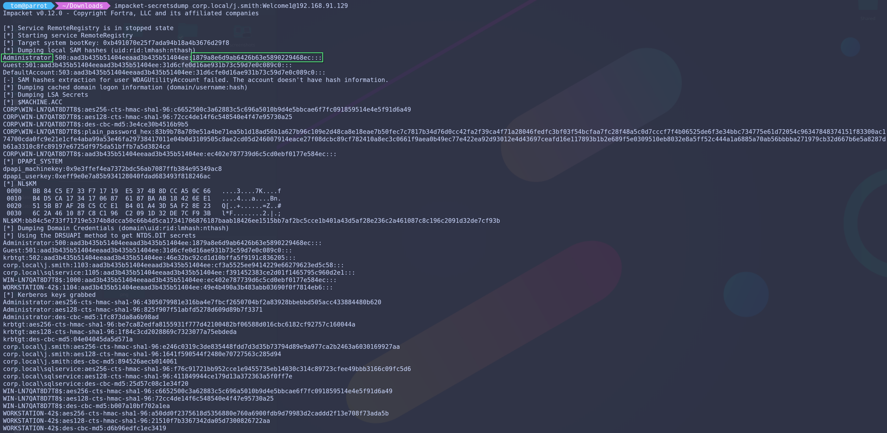
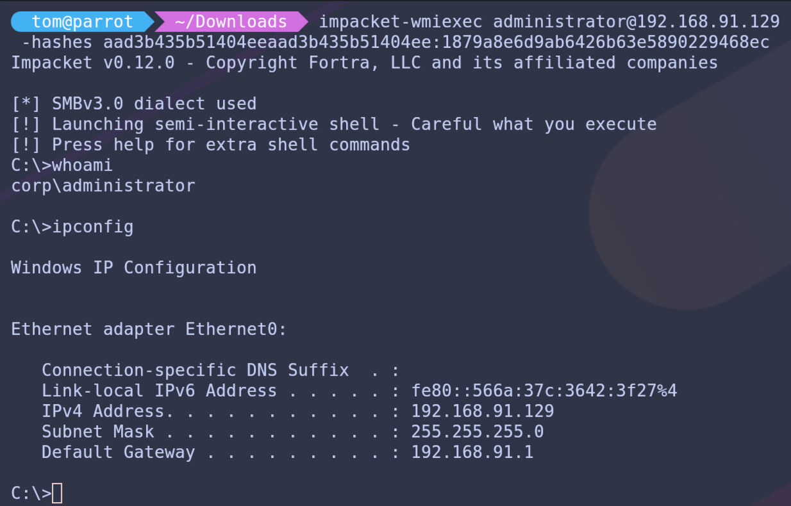
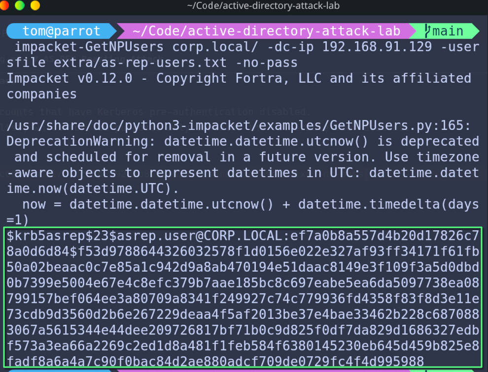
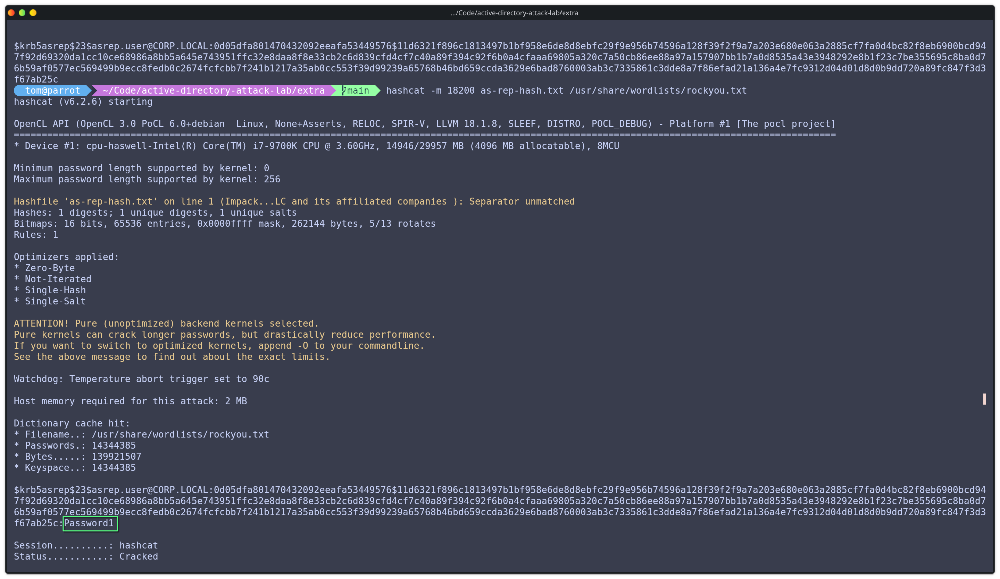
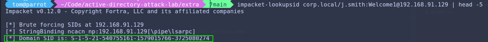
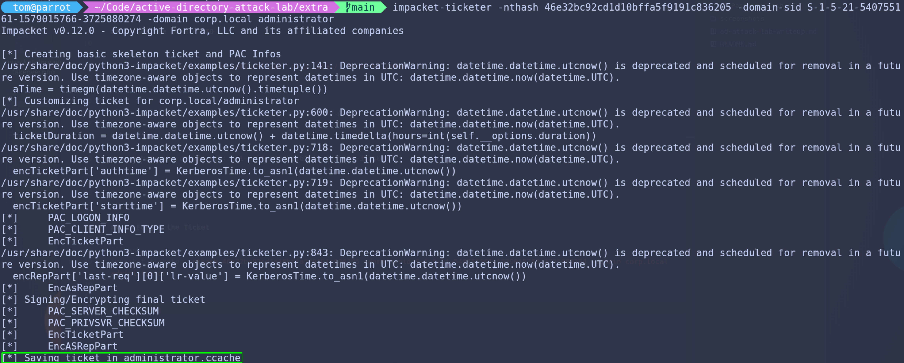

# Active Directory Attack Lab Write-Up

## Table of Contents
1. Overview
2. Lab Environment
3. Reconnaissance and Enumeration
4. Attack Techniques
   - 4.1 LLMNR / NBT-NS Poisoning
   - 4.2 Kerberoasting
   - 4.3 BloodHound Privilege Escalation
   - 4.4 Pass-the-Hash
5. Additional Techniques
   - 5.1 AS-REP Roasting
   - 5.2 SMB Share Enumeration
   - 5.3 DCSync
   - 5.4 Golden Ticket
6. Detection Opportunities
7. Mitigation Strategies
8. Conclusion
9. References

---

## 1. Overview

This document describes a simulated Active Directory attack lab designed to demonstrate common techniques used by attackers to compromise enterprise Windows environments.

The objective of this lab was to gain hands-on experience with credential attacks, Active Directory enumeration, privilege escalation, and lateral movement techniques.

The environment consists of a small domain with a domain controller, a domain-joined workstation, and an attacker machine running Parrot Security OS.

---

## 2. Lab Environment

The Parrot Security OS system acts as the attacker platform and performs reconnaissance and exploitation against the domain environment. The Windows Server system functions as the domain controller for the **corp.local** Active Directory domain, while the Windows 11 machine represents a typical enterprise workstation.

```
        +----------------------+
        |   Parrot Security OS |
        |   Attacker Machine   |
        |   192.168.91.128     |
        +----------+-----------+
                   |
                   |  VMware Virtual Network
                   |
+------------------+-------------------+
|                                      |
|       Active Directory Network       |
|                                      |
|   +---------------------------+      |
|   | Windows Server 2022       |      |
|   | Domain Controller         |      |
|   | Domain: corp.local        |      |
|   | DNS / AD DS               |      |
|   | 192.168.91.129            |      |
|   +-------------+-------------+      |
|                 |                    |
|   +-------------+-------------+      |
|   | Windows 11 Client         |      |
|   | Domain Joined Workstation |      |
|   | CORP\jsmith               |      |
|   +---------------------------+      |
|                                      |
+--------------------------------------+
```

| System            | Operating System    | Role                        | IP Address     |
|-------------------|---------------------|-----------------------------|----------------|
| Domain Controller | Windows Server 2022 | Active Directory / DNS      | 192.168.91.129 |
| Workstation       | Windows 11          | Domain User Host            | 192.168.91.130 |
| Attacker          | Parrot Security OS  | Penetration Testing Machine | 192.168.91.128 |

Network Range: 192.168.91.0/24

Virtualization Platform: VMware Workstation Pro

DNS Provider: Domain Controller

---

## 3. Reconnaissance and Enumeration

Initial reconnaissance was performed to identify accessible systems, users, and network resources.

### Enumeration Activities

- Network host identification
- SMB share discovery
- Domain user enumeration
- Active Directory relationship discovery

### Tools Used

- Responder
- CrackMapExec
- BloodHound
- Impacket

---

## 4. Attack Techniques

The following attack techniques were demonstrated in this lab:

1. LLMNR Poisoning
2. Kerberoasting
3. Active Directory Privilege Escalation using BloodHound
4. Pass-the-Hash
5. AS-REP Roasting
6. SMB Share Enumeration
7. DCSync
8. Golden Ticket

---

### 4.1 LLMNR / NBT-NS Poisoning

**Objective**

Capture NTLM authentication hashes by responding to broadcast name resolution requests on the network.

**Method**

The attacker system listens for LLMNR or NBT-NS broadcasts. When a victim system attempts to resolve an unknown hostname, the attacker responds and tricks the victim into authenticating, capturing an NTLMv2 hash in the process.

**Evidence**


Responder and hash in yellow pictured above.


Using CrackMapExec to verify creditenals.

---

### 4.2 Kerberoasting

**Objective**

Recover passwords for service accounts that have Service Principal Names (SPNs) registered in Active Directory.

**Method**

Kerberos service tickets are requested for accounts with SPNs. These tickets are encrypted using the service account password hash and can be cracked offline without any further interaction with the domain.

**Evidence**


---

### 4.3 BloodHound Privilege Escalation

**Objective**

Identify privilege escalation paths within Active Directory relationships.

**Method**

Active Directory objects and permissions are collected using SharpHound and visualized using graph analysis in BloodHound to identify potential attack paths to Domain Admin.

**Evidence**





---

### 4.4 Pass-the-Hash

**Objective**

Authenticate to remote systems using captured NTLM password hashes without knowing the plaintext password.

**Method**

NTLM hashes are dumped from the domain controller using Impacket secretsdump, then reused to authenticate to the DC without needing the plaintext password.

**Evidence**





### We get a shell!

&nbsp;

# 5. Additional Techniques

---

## 5.1 AS-REP Roasting

Accounts with Kerberos pre-authentication disabled expose encrypted authentication responses that can be cracked offline to recover plaintext passwords. The first screenshot is the hash, and the second is after hashcat cracked it.



The hash pictured above and the cracked hash pictured below.



---

## 5.2 SMB Share Enumeration

Network shares were enumerated to identify accessible resources and potentially sensitive files stored within the domain environment.


---

## 5.3 DCSync

Attackers with replication privileges can impersonate a domain controller and request credential replication data, allowing extraction of password hashes for all domain users including the `krbtgt` account.


---

## 5.4 Golden Ticket

Using the `krbtgt` hash obtained via DCSync, a forged Kerberos ticket (Golden Ticket) can be created. This ticket grants persistent access to the domain and is valid even if user passwords are changed, as long as the `krbtgt` password remains the same.





---

## 6. Detection Opportunities

Security teams may detect these attack techniques through monitoring and log analysis. Indicators may include:

- abnormal Kerberos ticket requests originating from user workstations
- excessive authentication failures across multiple user accounts
- suspicious LLMNR or NBT-NS broadcast traffic on the network
- unusual SMB authentication attempts between internal hosts
- unexpected privilege escalation or changes in group membership
- authentication events originating from non-standard systems

These indicators can often be observed in Windows Event Logs, SIEM platforms, and network monitoring tools.

---

## 7. Mitigation Strategies

Organizations can reduce the risk of these attacks by implementing several defensive controls:

- disable LLMNR and NBT-NS across the environment
- enforce SMB signing to prevent relay attacks
- implement strong password policies and account lockout policies
- deploy multi-factor authentication for privileged accounts
- follow the principle of least privilege for user and service accounts
- regularly audit Active Directory permissions and group memberships
- monitor authentication logs for unusual patterns

These controls significantly reduce the effectiveness of common Active Directory attack techniques.

---

## 8. Conclusion

This lab demonstrates how common Active Directory misconfigurations can be leveraged by attackers to gain access to domain resources and escalate privileges within an enterprise environment.

By performing these attacks in a controlled lab environment, it becomes possible to better understand how attackers move through a network and how defensive teams can detect and prevent these activities.

Understanding these techniques is valuable for both offensive security testing and defensive security monitoring.

---

## 9. References

- Microsoft Active Directory Security Best Practices
- MITRE ATT&CK Framework
- Kerberos Authentication Documentation (Microsoft)
- Impacket Tool Documentation
- BloodHound Project Documentation
- Responder Tool Documentation

---
