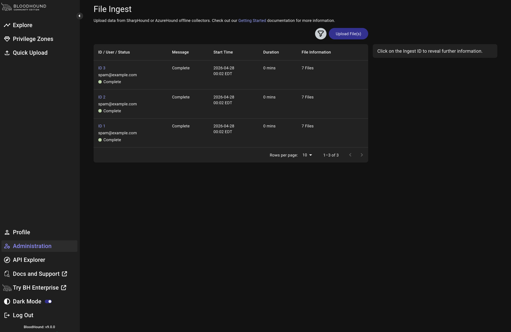
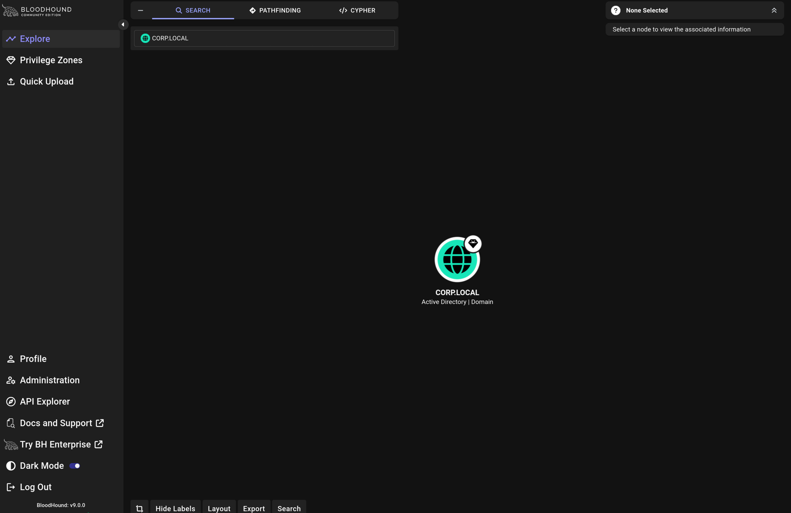

# BloodHound Privilege Escalation

---

BloodHound is a tool that uses graph theory to map Active Directory relationships and identify privilege escalation paths. It consists of two parts: SharpHound, which collects data from the domain, and the BloodHound UI, which visualizes attack paths.

---
&nbsp;

## 1. Collect Domain Data with SharpHound

SharpHound is run on the domain-joined Windows 11 workstation as `j.smith` to collect AD relationship data.

```bash
SharpHound.exe
```

SharpHound collects users, groups, computers, sessions, and ACLs then packages everything into a zip file for import into BloodHound.

&nbsp;



&nbsp;

---
&nbsp;

## 2. Import Data into BloodHound

The zip file generated by SharpHound is uploaded to the BloodHound CE interface via Quick Upload.

&nbsp;



&nbsp;

---
&nbsp;

## 3. Identify Attack Paths

Using the Pathfinding feature we can map the shortest path from `j.smith` to `Domain Admins`.

&nbsp;


&nbsp;

The graph reveals the relationships between domain objects and highlights how a low privilege user can reach Domain Administrator access through AD misconfigurations and group memberships.

&nbsp;


---
