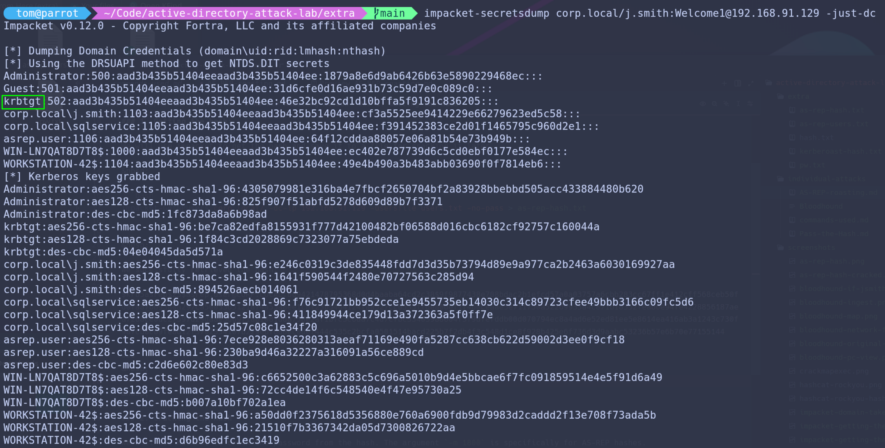

# DCSync

---

This attack uses the Pass-the-Hash shell we already have, the only difference here is that we use the flag -just-dc so that it performs DCSync by replicating the credentials just like the Domain Controller would.

---
&nbsp;

We simple run the same command with the new flag:

```bash
impacket-secretsdump corp.local/j.smith:Welcome1@192.168.91.129 -just-dc
```


Below is the output of the command, if you notice, the hash that comes after the krbgt is **significant** because it can be used in a **Golden Ticket** attack.

&nbsp;


