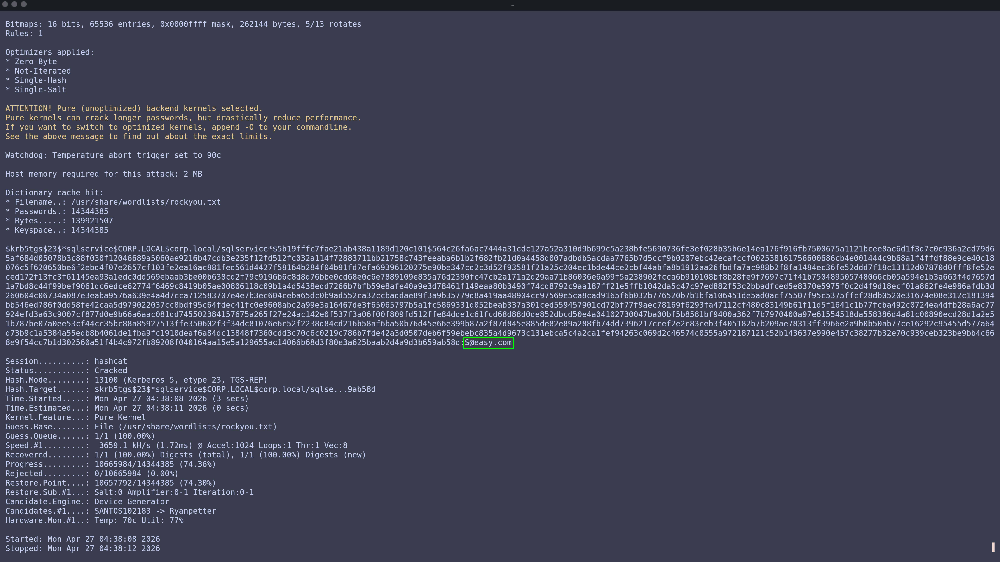
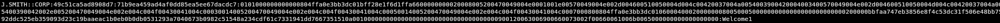

# Kerberoasting Attack

Kerberoasting targets service accounts that have Service Principal Names (SPNs) registered in Active Directory. Any authenticated domain user can request a Kerberos service ticket for these accounts, and the ticket is encrypted with the service account's password hash — meaning it can be cracked offline.

---
&nbsp;

## 1. Request the Service Ticket

We use Impacket to request a Kerberos service ticket for any account with an SPN registered in the domain.

```bash
impacket-GetUserSPNs corp.local/j.smith:Welcome1 -dc-ip 192.168.91.129 -request -outputfile kerberoast.txt
```

The `-request` flag automatically requests the ticket and the `-outputfile` flag saves the hash for cracking.

&nbsp;



&nbsp;

The `sqlservice` account was identified with the SPN `MSSQLSvc/corp.local:1433` and its ticket hash was successfully retrieved.

---
&nbsp;

## 2. Crack the Hash

We use Hashcat to crack the Kerberos TGS-REP hash offline against the rockyou wordlist.

```bash
hashcat -m 13100 kerberoast.txt /usr/share/wordlists/rockyou.txt
```

The `-m` argument specifies the hash type — `13100` is for Kerberos 5 TGS-REP hashes (etype 23), which is what Kerberoasting produces.

&nbsp;



&nbsp;

The password for the `sqlservice` account was successfully recovered in plaintext.

---
&nbsp;

## Result

With the cracked service account password, an attacker can authenticate as that service account, potentially accessing sensitive systems or escalating privileges further within the domain.
