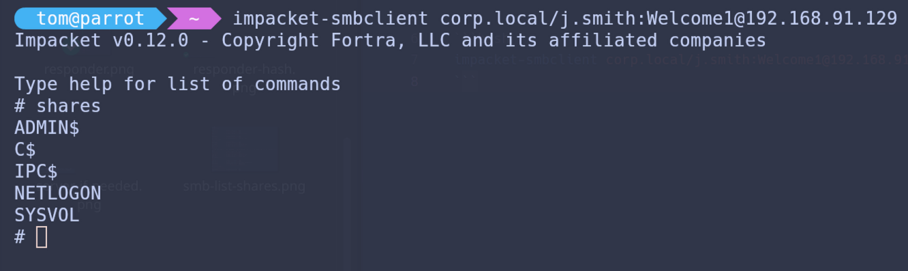
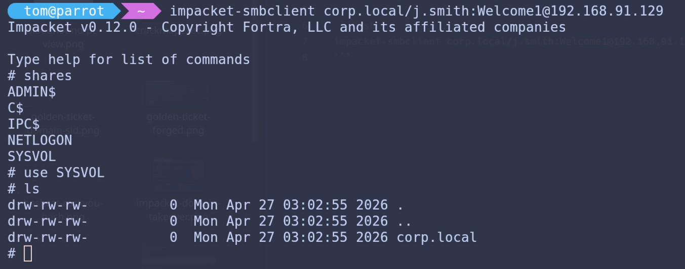
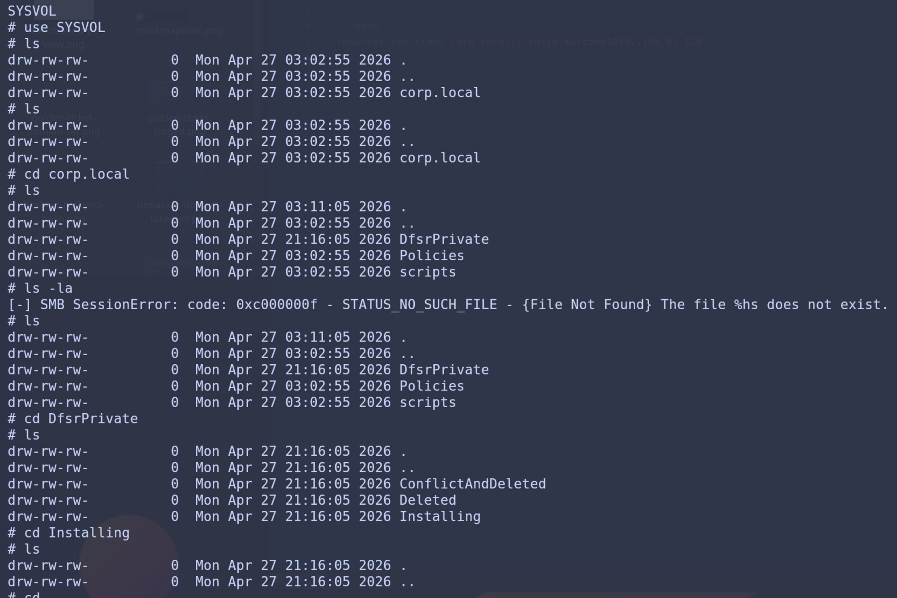

# This is to show the different shares on the network

SMB Share Enumeration is used to identify accessible network shares within the domain environment. Discovering these shares can reveal sensitive files, misconfigured permissions, and opportunites for potential lateral movement. 

```bash
impacket-smbclient corp.local/j.smith:Welcome1@192.168.91.129
```

---
&nbsp;



This list of different shares.

&nbsp;

---



The SYSVOL share being opened.

&nbsp;

---

& The shares just being explored more.



&nbsp;

---
