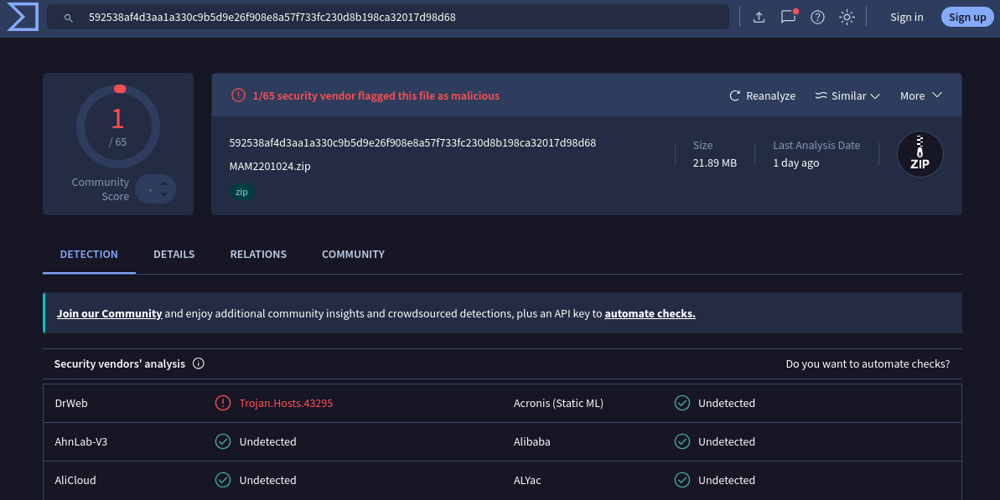
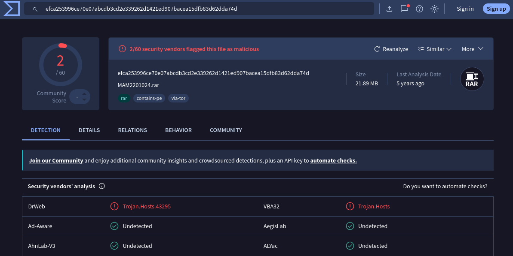
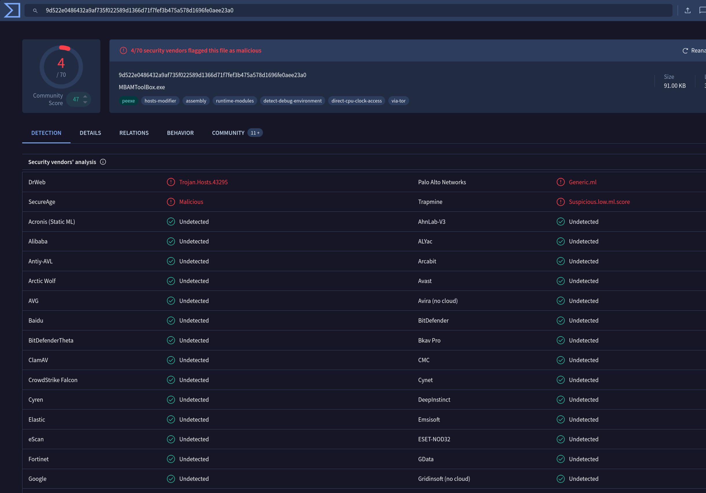

# Case 01 - Malwarebytes Forever Edition from My Pal

**Author:** Tom Graham  
**Platform:** Parrot OS (bare metal)  
**Date:** May 8, 2026
**Series:** Security Research Portfolio — tgraham.dev

---

## Prerequisites

| Tool | Purpose | Install |
|------|---------|---------|
| vt-cli | VirusTotal CLI (with API key) | [GitHub](https://github.com/VirusTotal/vt-cli) |
| unrar | Extract RAR archives | `sudo apt install unrar` |
| binutils | strings analysis | `sudo apt install binutils` |
| Wireshark | Packet analysis | `sudo apt install wireshark` |
| Sherlock | OSINT username search | `sudo apt install sherlock` |

## Setup

```zsh
git clone https://github.com/VirusTotal/vt-cli
nvim ~/.zshrc # or bash if you're lame
source ~/.zshrc # or fish if you're weird 
vt init # API Key found on VirusTotal website under profile settings.
```


Okay, the situation is that my not-so-tech-savvy friend wanted to provide me a free AV that he claimed, "lasts forever", which he could not further describe... So I decided to help him and see if he is just downloading malware. 

He said he downloaded it from the *not suspect at all* Mega.nz, not to be confused with megaupload.nz, which the FBI has now seized for warez, and malicious software. However, I'm sure that's unrelated.

This is the investigation:

&nbsp;

---

## Phase 1 - Outermost zip file malwarebytesFOREVER.zip

We can see the shady looking malwarebytesFOREVER.zip... Lets download it, and see if it really is a forever edition! We will run a few basic commands to start basic triage of the file.

```zsh
file malwarebytesFOREVER.zip
ls -lh malwarebytesFOREVER.zip
sha256sum malwarebytesFOREVER.zip
  592538af4d3aa1a330c9b5d9e26f908e8a57f733fc230d8b198ca32017d98d68 malwarebytesFOREVER.zip
```

Now, we will use that hash, of only the zip file, and run the vt scan to review the results.

```zsh
vt file 592538af4d3aa1a330c9b5d9e26f908e8a57f733fc230d8b198ca32017d98d68
```

<p>
First impressions are, immediately seeing the result Trojan is spooky, but, no fear, DrWeb is notorious for its false positives, and... well being too neurotic all together. (Looking at you SUPERAntiSpyware...90s)
</p>


  
*Figure 1: VT scan results for the zip file.*

An interesting line in vt output, pictured below, is the meaningful name of this zip, also known as `MAM2201024.zip`, this means this exact file name has been scanned before. In addition to that, the zip file was identified with 66.6% confidence as a firefox browser extension by TriID.

Below are those excerpts from the output:

```json
{
  "scans": {
    "DrWeb": {
      "category": "malicious",
      "engine_name": "DrWeb", // Who's that?
      "engine_update": "20260505",
      "engine_version": "7.0.75.2070",
      "method": "blacklist",
      "result": "Trojan.Hosts.43295" // AHH! 
    }
  }
}
```
*Interesting output. Very wrong, but interesting.*

```json
{
  "meaningful_name": "MAM2201024.zip",
  "names": [
    "MAM2201024.zip"
  ]
}
```
*The meaningful name, MAM2201024 as identified by VirusTotal.*,

```json
  "trid": [
    {
      "file_type": "Mozilla Firefox browser extension",
      "probability": 66.6
    },
    {
      "file_type": "ZIP compressed archive",
      "probability": 33.3
    }
  ]
```

*Okay... TriID has a higher confidence level that the file is a Mozilla Firefox browser extension(no manifest?), than the fact that it is a ZIP compressed archive. Well at least we know, for sure, that TriID really tried to identify, ID if you will, the file.*

[View on VirusTotal](https://www.virustotal.com/gui/file/592538af4d3aa1a330c9b5d9e26f908e8a57f733fc230d8b198ca32017d98d68)

[View JSON Results](./scan-results/case01-vt-results-zip.json)

Finally! we can extract:

```zsh
unzip malwarebytesFOREVER.zip -d case01/
ls -lh case01/
  - .rw-rw-r--  21.9M tom   6 May 03:20   MAM2201024.rar
```

<p>
A rar within a zip, classic! This can sometimes be bad, and layering compressed folders can have an affect on the vt scan, so it's important to extract and scan the contents separately. Though likely, nowadays stacking folders probably won't have a significant impact on the vt scan. Although, it did hide one detection.
</p>

<p>
The internal name MAM2201024, is a meaningful_name likely because it is consistent with legitimate Malwarebytes naming conventions, and the 2016 date is not immediately alarming — Malwarebytes, like most AVs, updates definitions automatically after installation regardless of installer age. However, this does not reduce suspicion. A legitimate installer can still carry a malicious payload.
</p>

&nbsp;

---

## Phase 2 - Scanning of MAM2201024.rar

Same process as the first step, however, this time we are hoping the actual compressed file is more exciting.

```bash
file case01/MAM2201024.rar
sha256sum case01/MAM2201024.rar
  efca253996ce70e07abcdb3cd2e339262d1421ed907bacea15dfb83d62dda74d case01/MAM2201024.rar
vt file efca253996ce70e07abcdb3cd2e339262d1421ed907bacea15dfb83d62dda74d
```


**Figure 2 — Preview of unzip before letting the files loose.**


Below is the JSON output from the vt cli ran against the `MAM2201024.rar` file hash:

```json
{
  "tags": [
    "contains-pe"   // The .exe files are inside
  ],
  "via-tor": true,
  "rar": true,
  "packers": {
    "F-PROT": "INNO, appended"  // The payload appended to legit installer (Uh oh!)
  },
  "last_analysis_stats": {
    "malicious": 2  // up from 1 on the zip
  },
  "DrWeb": "Trojan.Hosts.43295",  
  "VBA32": "Trojan.Hosts"        // An additional trojan added to the scan results
}
```
*Output of MAM2201024.rar from the VirusTotal scan*

&nbsp;

VBA32 joins DrWeb with a second flag indicating VBA32 also detected the trojan. 

For a regular INNO installer it just installs the files, but when there is an appended payload, it means there is something else bundled with the original installer, which we will investigate further.

The takeaway from this is that there is an appended payload to the legitimate installer. Now, we will determine if the appended code is exactly what my friend wants and has received his forever version! or if he is, more likely, about to be forever hacked!



**Figure 3 — VirusTotal scan results for the deeper MAM2201024.rar.**

[View on VirusTotal](https://www.virustotal.com/gui/file/efca253996ce70e07abcdb3cd2e339262d1421ed907bacea15dfb83d62dda74d)

[View JSON Output](./scan-results/case01-vt-results-rar.json)

&nbsp;

---

## Phase 3 - Scanning and Investigating the Unzipped Files

Finally, it's time to see what is actually inside of these executable binaries:

```zsh
unrar e MAM2201024.rar -op case01/
cd case01/
sha256sum MBAMToolBox2.exe
  9d522e0486432a9af735f022589d1366d71f7fef3b475a578d1696fe0aee23a0  MBAMToolBox2.exe
vt file 9d522e0486432a9af735f022589d1366d71f7fef3b475a578d1696fe0aee23a0
```

<p>
The vt scan results for the crack are shown below. There are now four AV companies convinced, still good old DrWeb, SecureAge, Palo Alto Networks, and Trapmine. It looks like VBA32 has changed its mind.
</p>



**Figure 4 — This is the vt scan of the crack called MBAMToolBox2.exe.**

Below are the most important parts of the vt scan results as JSON for the crack:

```json
"tags": [
  "peexe",
  "hosts-modifier",    // This writes to the hosts file to prevent Malwarebytes from verifying the license by blocking the licensing server
  "assembly",
  "detect-debug-environment",  // Evasion: This is an active check to see if the binary is being debugged or analyzed.
  "direct-cpu-clock-access",   // Evasion: Direct CPU clock access to check for VMs or Sandboxes
  "via-tor"            
]
```
*The interesting tags listed in the JSON output above.*

The hosts-modifier tag indicates that the crack is actually doing what a crack is supposed to do. There are multiple evasion techniques, including direct CPU clock access and active debug environment checks.

Of course, with any crack, keygen, or warez, the authors often sign their code with their signature, likely so others in the *bad bad* community can see who cracked it, basically for "cred" but not enough to get caught!

```json
{
  "malicious": 4,  // We've now gotten up to 4 out of 72 saying it's malicious.
  "names": [
    "MBAMToolBox2 by Chamsoo CodeBreak.exe",  // Cracker signature
    "MBAMToolBox2 by TechMaxed.exe"          // Distributed by multiple crackers
  ]
}
```
*The JSON output above shows the cracker's signature.*

```json
{
  "reputation": 47,
  "total_votes": {
    "harmless": 16,
    "malicious": 4
  },
  "comments": "MBAM ToolBox 2.2 [SLEDGE101]"  // Cracker signature again
}
```
*The JSON output above shows the cracker's signature again. This time the signature is GOLD. (You'll see)*

---

[View on VirusTotal](https://www.virustotal.com/gui/file/9d522e0486432a9af735f022589d1366d71f7fef3b475a578d1696fe0aee23a0)

[View JSON Output](./scan-results/case01-vt-results-crack.json)

---

Now last step, we run strings on the MBAMToolBox2.exe file to see if there are any hidden strings that could give us a clue as to what it does, and to peek to see if there is anything interesting that the cracker left behind.

Hmm! It looks like our cracker, SLEDGE101 has left a full path to the pdb file. Which is a debug symbol file that contains the source code of the program, which could be useful for reverse engineering. However, at this point it's just really funny and not useful. 

```zsh
strings MBAMToolBox2.exe | grep "C:" # I did this because I know what is in the strings file (This is the only juicy find)
C:\Users\SLEDGE101\Documents\Visual Studio 2015\Projects\MBAMToolBox_10152015\MBAMToolBox\obj\Debug\MBAMToolBox.pdb
```

Welp. That shouldn't be there.

---

## How does the crack work?

The way that the crack works is, first you need to know what a hosts file is. It's a file that your computer checks before connecting to a website.
There are really good premade host files out there to block malicious websites. (For example, [StevenBlack's hosts file](https://github.com/StevenBlack/hosts)) In addition, a lot of adblockers use host files as block lists to block ads or malicious content.

Below is what a host file looks like, of course we don't want our computer to be deleted! I just downloaded more RAM last week! So this rule blocks that in case my friend were over, and he accidentally clicked on the link. It will simply reroute the connection to your local machine (127.0.0.1), successfully blocking the connection. Phew, computer saved.

```
127.0.0.1       www.iwilldeleteyourcomputerifyouclick.com
```

So now that you know how host files work, the way the crack works is that the cracker changed it to block the Malwarebytes licensing servers. This way if you are using Malwarebytes and it does a lookup it will just reroute the connection to home 127.0.0.1. 

Pretty interesting stuff to learn about! 

Do not try at home! or anywhere...

&nbsp;

---

## OSINT Pivot — SLEDGE101 - Really puts the 101 in 101!

The PDB path leaked the following developer fingerprint:

| Field | Value |
|---|---|
| Username | SLEDGE101 |
| OS | Windows 10 |
| IDE | Visual Studio 2015 |
| Project Date | October 15, 2015 |
| Build Type | Debug *(release builds strip PDB paths — rookie mistake)* |

Just out of curiosity, I decided to run a quick Sherlock sweep, and it returned **76 platform matches** for SLEDGE101!
This is an unusually high footprint for a username of this specificity. Notable hits include presence on cracking forums and torrent sites; consistent with the binary's origin, as well as bug bounty platforms.
However, later registrations suggest a possible pivot, hopefully to **legitimate security research**! Go sledge!

So, I was able to get a live session while SLEDGE101 was logged in, this is what happened: (~~Law and order bells~~)

```zsh
sledge101@sledgeh4x: $ cd C:\Users\SLEDGE101
sledge101@sledgeh4x: $ cd \Documents\Visual Studio 2015\Projects
sledge101@sledgeh4x: $ cd \MBAMToolBox_10152015\MBAMToolBox\obj
sledge101@sledgeh4x: $ cd Debug #PHEW MADE IT 
sledge101@sledgeh4x: $ pwd
C:\Users\SLEDGE101\Documents\Visual Studio 2015\Projects\MBAMToolBox_10152015\MBAMToolBox\obj\Debug
``` 
*Our found hacker, live and breathing, meticulously navigating his way through the filesystem, DOUBLE CHECKS where he is... and my session is terminated.*

&nbsp;

## Schrödinger's Sledge

`MBAMToolBox2.exe` actively detects debuggers and virtual environments, behaving differently depending on whether it is being **observed**. The true payload exists in superposition. 

The implications of this crack abusing the Quantum Entanglement vulnerability and exploiting Malwarebytes' installations everywhere are extraordinary.

&nbsp;

---

## Verdict

A working crack. SLEDGE101 delivered exactly what was promised - Malwarebytes, forever. The mechanism is clever, the OPSEC is not.

The binary is guilty. `./SUSTAINED && !WITHDRAWN + THE TRIBE HAS SPOKEN`

However, this binary actively evades analysis — which is a topic worthy of its own dedicated reverse engineering lab. 

---

&nbsp;
&nbsp;

Haha. :) Thanks for reading!

Remember: Purely educational purposes only.

---

&nbsp;
