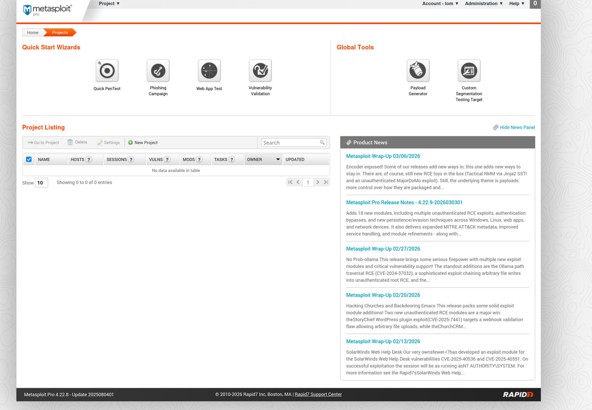
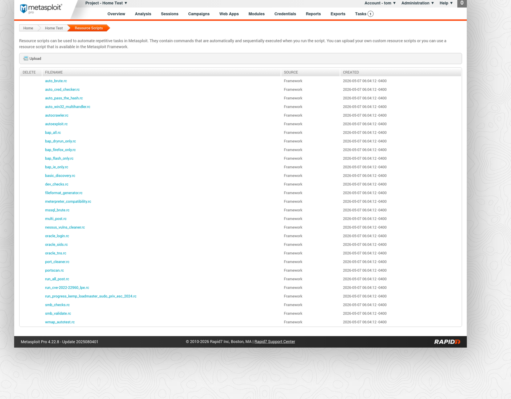
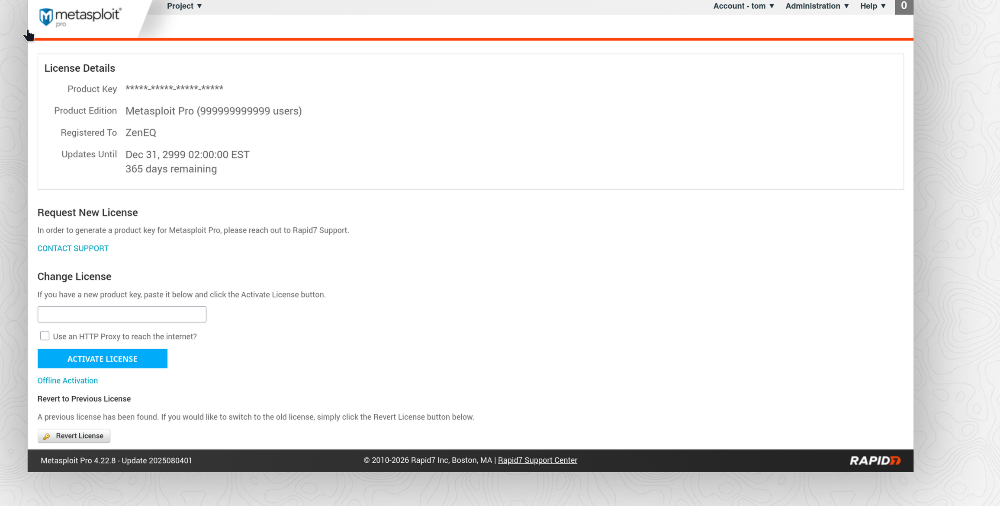
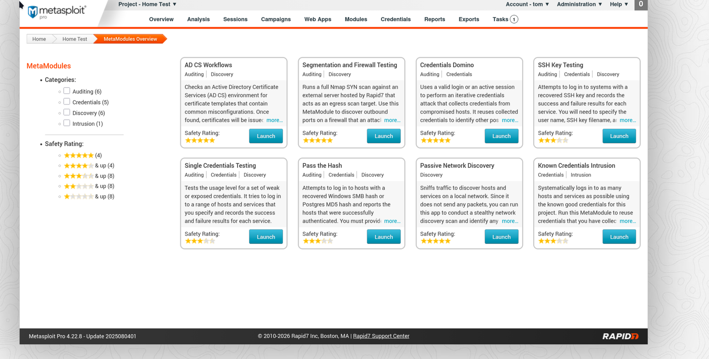

<!-- Rapid7 if you found this, I'll buy a real license when employed. See tgraham.dev for my CV. ~ close to Boston ~ -->

# Case 02 - Metasploit Pro — SUP3R SECURITY TOOLZ

**Author:** Tom Graham  
**Platform:** Parrot OS (bare metal)  
**Date:** May 8, 2026  
**Series:** Security Research Portfolio — tgraham.dev

---

## Prerequisites

| Tool | Purpose | Install |
|------|---------|---------|
| vt-cli | VirusTotal CLI (with API key) | [GitHub](https://github.com/VirusTotal/vt-cli) |
| tar | Extract tar archives | built-in |
| binutils | strings analysis | `sudo apt install binutils` |

## Setup

```zsh
vt init # API Key found on VirusTotal website under profile settings.
```

---

## Background

My friend, who we will refer to as Alec — SUPER secret!; What is?; — listened to my Case 01 explanation and immediately declared himself a h4x0r. He googled "how to become the best hacker" and somehow ended up with a "working" version of Metasploit Pro, which he describes as "acting bizarre". Shocking. I'm super embarrassed because he actually has one cool thing I like. So we will be exchanging that good for **NOT THIS SOFTWARE** but my knowledge of what this software does, crack, no crack, keygen, completely real, pascal, anything, but the good that I NEED is his new license plate... I don't even know how he managed to get it, Grr. script kiddie, I think to myself. But no, really, he has the most epic, LEGEND....DARY license plate of all time, ...it is, ugh it even aggravates me to say, "NOPSLEDx90". Incredible. He got it put on his snowmobile because of that stupid game show he works for. I think it's Geopardy? Hmm or Jeoparody? 

The worst thing is...he dislikes the plate because he said he hates Network Operations, wifi, wires, telephone poles, owls, transistors, and grapes. Hmph, oh well. I wish I knew him more but every time I ask him a question he's so strange, and responds like he does on his show, "What is Guadalupe?", or whatever the answer is... I wish he understood physics, so he can see these crazy analogies, filled with anomalies, but his knowledge is all history, if you seen that weird show, anyways physics makes a comeback with this backstory as a `NOPSLEDx90` is famously Schrödinger's Sled. I know, ridiculous, but follow me; It both exists and doesn't exist; Red shift blue shift up down left right select start, then when the instruction pointer lands on it. & Me clearly being the instructor, it's when I own my license plate, as long as nobody is observing, stupid Quantum physics. 

The location of the file: the *not suspect at all* Mega.nz — not to be confused with Megaupload, which the FBI shut down in 2012. Totally different service. Probably.

The file arrived with the subtle, understated name: `hidd3nw4rez.tar.gz`. At this point our threat model was already updating itself.

&nbsp;

---

## Phase 1 — Initial Triage

The first few commands to run on the file before extracting:

```zsh
file hidd3nw4rez.tar.gz
ls -lh hidd3nw4rez.tar.gz
sha256sum hidd3nw4rez.tar.gz | tee case02-targz.sha256
  c3ce7ea386ed88fb8797e31fba8947af883500ef20227892aa5a7fdc7dc2d0c0  hidd3nw4rez.tar.gz
```

Since the files were zipped together locally, this is a fresh hash with no previous VirusTotal entries — expected.

```zsh
vt file c3ce7ea386ed88fb8797e31fba8947af883500ef20227892aa5a7fdc7dc2d0c0
```

Next step — extract:

```zsh
tar -xf hidd3nw4rez.tar.gz
```

The extracted file structure:

~~~
hidd3nw4rez.tar.gz
├── README.txt
├── Linux/
│   ├── metasploit-linux-x64-installer.run   ← actual installer
│   ├── patch.sh                             ← patch script
│   ├── patch_arch.sh                        ← Arch Linux specific patch, arch btw, noty
│   ├── license.rb                           ← license manipulation
│   ├── tasks.rb                             ← RPC task module, return true to every question regarding licensing 
│   ├── application.html.erb                 ← web template
│   ├── application_controller.rb            ← Rails controller
│   └── README.txt
└── Windows/                                                          <- rm -rf Windows/*
    ├── metasploit-windows-x64-installer.exe ← actual installer
    ├── Patch.bat                            ← Windows patch script
    ├── license.rb                           ← license manipulation
    ├── tasks.rb                             ← RPC task module
    ├── application.html.erb                 ← web template
    ├── application_controller.rb            ← Rails controller
    └── README.txt
~~~

Metasploit Pro is Ruby/Rails based so these files could be legitimate or patched. The `.erb` template files are standard Rails web templates.

Since we are on Linux, we will proceed with the Linux version as if installing.

The `Linux/README.txt` contains legitimately accurate information:
1. Real Metasploit Pro runs on `localhost:3790` 
2. The documentation matches the actual Pro documentation 
3. It mentions Arch Linux specifically — the author is knowledgeable 

The crack mechanism is `patch.sh` or `patch_arch.sh` — and it **must** be run with `sudo`. This is a **significant** red flag. Allowing root access to patch a Rails application means it can do anything to your system. Woah!

&nbsp;

---

## Phase 2 — Reviewing the Ruby Files

The Ruby files are the crack. Let's read them before anything runs.

### license.rb

Every single license check is hardcoded to return `true`. The original code is left commented out right next to the replacement — you can literally see the legitimate code sitting there.

```ruby
def registered?
  true  # @registered ||= true
end

def activated?
  true  # @activated ||= true
end

def expired?
  false  # @expired ||= false
end

def valid?
  true
end

def perpetual?
  true  # @perpetual ? true : false
end
```

*A small portion of the file showing how every check is bypassed.*

The best parts — the cracker signed their work, set unlimited users, and gave themselves until the year 2999:

```ruby
@email      = "ZenEQ"                      # cracker signed their work
@users      = 999999999999                 # unlimited users
@expiration = "Dec 31, 2999 00:00:00 MST" # expires in 2999

def seconds_until_expired
  return 31536000  # always a year left
end

def pro?
  product_type == "Metasploit Pro"
  true  # just always true regardless
end
```

*The author was also considerate enough to leave the original code commented out — changing the absolute minimum required.*

### tasks.rb

The tasks.rb file is functionally identical to the legitimate Pro version with one notable addition, ZenEQ left a comment, a good coder, who gets it.

```ruby
# -- you know, why on earth wasn't this just removed/null 
#    in the first place??
# -- people who cracked this kept adding things in the list 
#    below and I mean... WTF
# -- yeah I added the "quick_pentest" so if you DO use this 
#    code (WHY WHY WHY??)
# -- then the whole thing will work without any license key - 
#    no need to contact and bother the good folks at Rapid7 
#    (thank you guys!)... anyway, just, like, seriously, 
#    the mind boggles... -zeneq
```

### application_controller.rb

This file is largely unmodified. The key connection is the `require_license` before_action which runs on every page request:

```ruby
before_action :require_license

def require_license
  @license = License.get
  if request.xhr? && !@license.valid?
    render :plain => "Not logged in", :layout => "forbidden", :status => 403
  else
    if not @license.activated?
      redirect_to root_path
    elsif @license.expired?
      redirect_to root_path
    end
  end
end
```

Every page request hits `require_license` → calls `License.get` → checks `activated?` and `expired?` — both of which ZenEQ hardcoded in `license.rb`. This is the lock. `license.rb` is the key.

---

## Phase 3 — patch.sh

The patch script brings it all together. It runs as root and does the following:

1. Stops the Metasploit service
2. Backs up the original files → `original_files.tgz` ← surprisingly thoughtful
3. Overwrites 4 core application files:
   - `/opt/metasploit/apps/pro/ui/app/views/layouts/application.html.erb`
   - `/opt/metasploit/apps/pro/ui/app/controllers/application_controller.rb`
   - `/opt/metasploit/apps/pro/ui/app/models/license.rb`
   - `/opt/metasploit/apps/pro/engine/app/concerns/metasploit/pro/engine/rpc/tasks.rb`
4. Restarts the service
5. Opens browser to `https://localhost:3790`

---

## Phase 4 — VirusTotal: Linux Installer

```zsh
sha256sum Linux/metasploit-linux-x64-installer.run | tee case02-installer-linux.sha256
vt file $(awk '{print $1}' case02-installer-linux.sha256)
```

```yaml
tags:
  - "upx"                       # UPX is common for large installers 
  - "detect-debug-environment"  # Evasion: Debug Environment Detection
  - "checks-cpu-name"           # Evasion: VM Detection
  - "sets-process-name"         # Process masquerading (suspect?)
```

YARA: Sigma rule hit — the installer runs `id -u` to check for root:

```yaml
rule_title: "Local System Accounts Discovery - Linux"
CommandLine: "/usr/bin/id id -u"
```

The EICAR test string was detected by Kaspersky — a deliberate inclusion by Rapid7 to verify AV functionality prior to installation:

```yaml
Kaspersky:
  result: "EICAR-Test-File"
```

[View on VirusTotal](https://www.virustotal.com/gui/file/d0da6ff1141736255beca1d23e77c184c9dc3a9ffb80beb6a73fa0ae332363f8)

[View CLI Results](./scan-results/Metasploit-Pro-Linux.txt)

---

## Phase 5 — VirusTotal: Windows Installer

```zsh
sha256sum Windows/metasploit-windows-x64-installer.exe | tee case02-installer-windows.sha256
vt file $(awk '{print $1}' case02-installer-windows.sha256)
  abe5b31ccd23e02d0e1489acc2cb12c075cedd6e4a24f5718111d05845fc9feb
```

The Windows installer is legitimately signed by Rapid7:

```yaml
signers:      "Rapid7 LLC"
verified:     "Signed"
copyright:    "Copyright Rapid7"
signing date: "07:59 PM 08/04/2025"
```

Valid DigiCert certificate chain, not expired, not tampered with. This is the real deal.

Notable tags:

```yaml
tags:
  - "signed"                    # legitimate ✅
  - "checks-cpu-name"           # VM detection
  - "detect-debug-environment"  # anti-debug
  - "persistence"               # writes persistence mechanisms
  - "overlay"                   # data appended after PE
```

And Tencent caught the EICAR test string on the Windows installer — the same string Kaspersky caught on Linux:

```yaml
Tencent:
  result: "EICAR-Test-File"
```

Both installers contain EICAR — deliberate Rapid7 inclusion, different engines caught it on each platform. Same string, same file type, two different vendors. No single engine provides consistent coverage.

[View on VirusTotal](https://www.virustotal.com/gui/file/abe5b31ccd23e02d0e1489acc2cb12c075cedd6e4a24f5718111d05845fc9feb)

[View CLI Results](./scan-results/Metasploit-Pro-Windows.txt)

---

## Software Results... in order to get you to BUY!

---

You gotta get this one guys, make your boss buy it!

&nbsp;

```
Product Key:      ***** ***** ***** *****  (redacted by MSP)
Product Edition:  Metasploit Pro (999999999999 users)
Registered To:    ZenEQ
Updates Until:    Dec 31, 2999 02:00:00 EST
                  365 days remaining                 
Version:          Metasploit Pro 4.22.8
Update:           2025080401
Copyright:        © 2010-2026 Rapid7 Inc, Boston, MA
```

&nbsp;




**Figure 1: The home landing page after initial setup.**
**Figure 2: Resource scripts that allow auto functioning.**

---




**Figure 3: Clearly shows the license being complete negated.**
**Figure 4: Module marketplace. Tons of stuff.**

&nbsp;

---

## OSINT Pivot — ZenEQ

Sorry, although ZenEQ performed significantly better than SLEDGE101.
Don't worry ZenEQ, hopefully you're not reading this, it was a good Pro crack method, but of course my work pays for mine ~~~ LFW btw.

&nbsp;

---

Results are in: 

ZenEQ has better OPSEC than SLEDGE101.
The bar was not high.
Both were located.
One clicks circles for fun.
The GitHub was... sparse.

&nbsp;

---

## Verdict

Both installers are legitimate signed Rapid7 binaries. The risk lives entirely in the patch files — readable Ruby and Bash source running as root, permanently modifying a professional exploitation framework.
ZenEQ's code appears clean, however trusting an anonymous cracker's Ruby code inside, Metasploit Pro is the security equivalent of handing someone your keys and asking them to only open the front door.

Oh ya, stop using usernames that are **EVERYWHERE** boyz. && I better tighten up my iptables, manually of course, don't want these boyz coming after me. But if you want to come for me... 127.0.0.1! 

Alec got his point and click. I got my license plate FTW. Now to start the next writeup!
Ctl+C/in vim/Ctrl+X&Y/oopsVIM/how again?/ESCAPE.... not working/${0x8thGrade}/ESC+I+q!/EZ

Haha. Thank you for reading!
Remember: Purely educational purposes only.

---

&nbsp;
