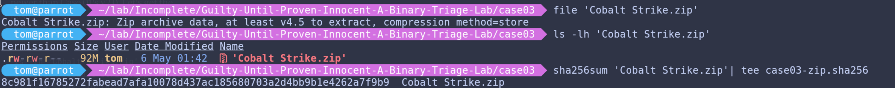
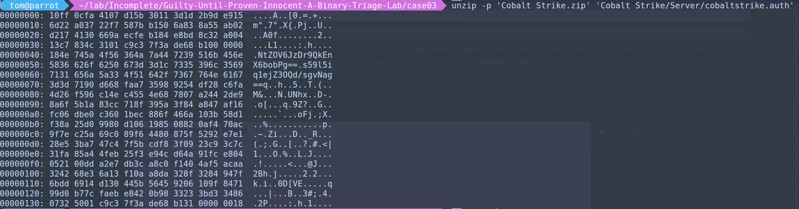
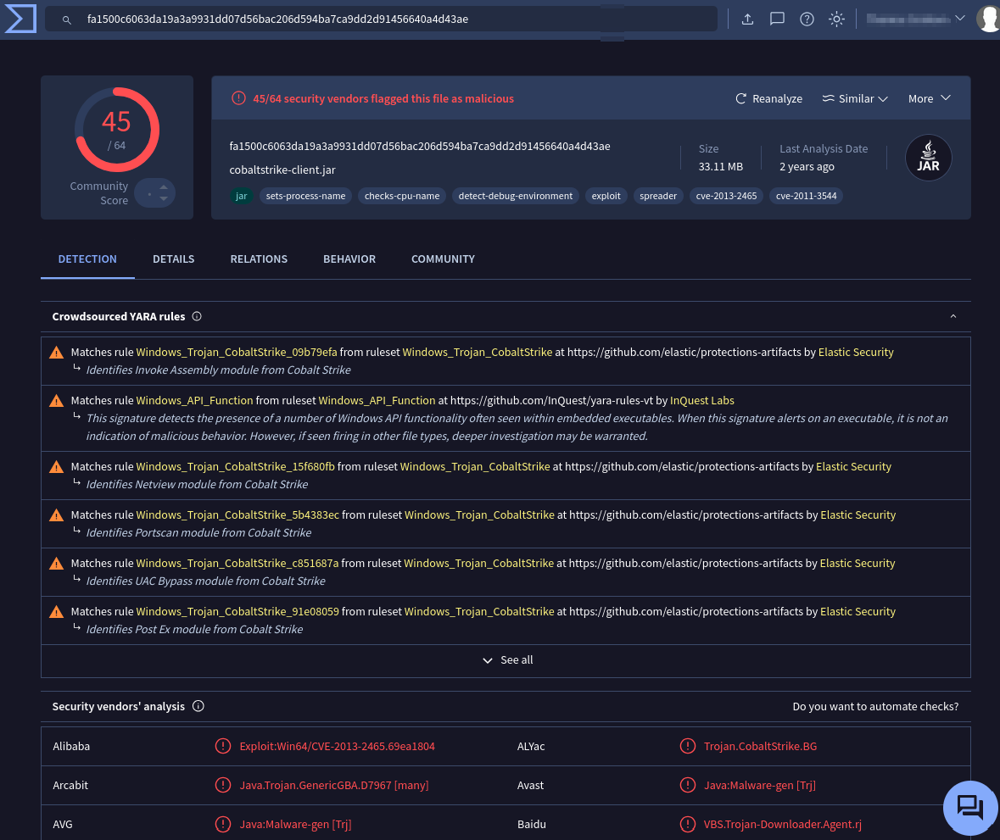
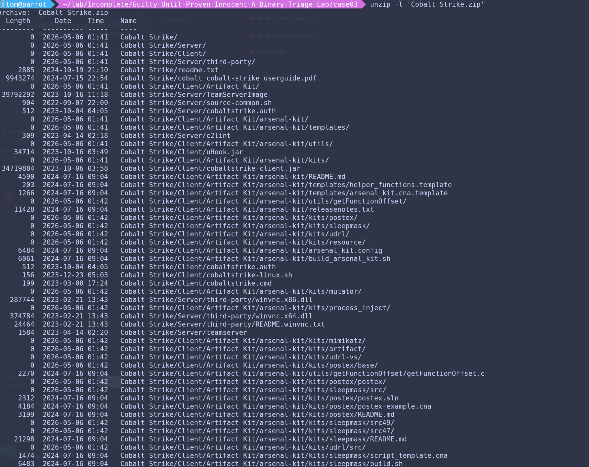

# Case 03 — I'll Take Federal Prison for $400, Alec
---

**Author:** Tom Graham  
**Platform:** Parrot OS (bare metal)  
**Date:** May 8, 2026
**Series:** Security Research Portfolio — tgraham.dev

---

## Prerequisites

| Tool | Purpose | Install |
|------|---------|---------|
| vt-cli | VirusTotal CLI (with API key) | [GitHub](https://github.com/VirusTotal/vt-cli) |
| unzip | Extract ZIP archives | `sudo apt install unzip` |
| xxd | Hex dump analysis | built-in |
| binutils | strings analysis | `sudo apt install binutils` |
| Sherlock | OSINT username search | `sudo apt install sherlock` |

---

## Background
---

My friend, who we will now start to refer to as SWIM (Someone Who Isn't Me), has once again graced me with a file from the not suspect at all Mega.nz vault. This time, SWIM has acquired Cobalt Strike — a Command & Control framework so powerful it has been used by nation state actors, ransomware gangs, and apparently, SWIM's study group. 

SWIM, whose legal name may or may not be Alec Trebak, obtained this particular sample via a dead drop on a floppy disk — allegedly from a guest appearance by one Kevin Mitnick on his game show. What Mitnick was doing on a game show is unclear. What he left behind was not. Trust no one.

It was scp'd to me. Via PuTTY. Good fella`

&nbsp;

This is the investigation. (Law & Order bells intensify)

&nbsp;

---

```zsh
file Cobalt Strike.zip
ls -lh Cobalt Strike.zip
sha256sum Cobalt Strike.zip | tee case03-zip.sha256
```

&nbsp;



&nbsp;

**Figure 1: Initial commands to run against the Cobalt Strike zip file before extracting, getting us the hash for Virus Total**

```zsh
vt file 8c981f16785272fabead7afa10078d437ac185680703a2d4bb9b1e4262a7f9b9
```

---

Findings:

- Initially, we can gather that this the zip is newer than case one (v4.5).
- 92MB is substantial which is consistent with a real Cobalt Strike zip file.

---

Okay so lets jump into unzipping the file.

```zsh
unzip 'Cobalt Strike.zip'
```

Upon unzipping, there are 128 files, this is the full install of Cobalt Strike, time to determine if it's malicious to us, real, or cracked!

The first interesting file is the license token:



**Figure 2 — The cobaltstrike.auth file in hex. Two Base64 encoded strings are embedded — cryptographically signed license tokens. Without Fortra's private key there is no way to decode what's inside. The crack, if there is one, 
is not here.**

---

```zsh
vt file fa0b9f181f3c676d2124d4a6d2be0a12fdad5da124b8d525b8c91d747288a781 > vt-teamserver-image.json
```

&nbsp;

Interesting portion from the TeamServerImage file:

```json
malicious: 0         
suspicious: 0
harmless: 0

sandbox_verdicts:
  Zenbox Linux:
    category: "harmless"
    confidence: 99    
    malware_classification: "CLEAN"     # This is, 99% chance, a clean file from a real Cobalt Strike installation

times_submitted: 79   # submitted 79 times
unique_sources: 73    # 73 different people have this exact file

tags:
  - "shared-lib"      # No Evasion tags
  - "elf"
  - "64bits"

meaningful_name: "TeamServerImage"
```

---

```zsh
vt fa1500c6063da19a3a9931dd07d56bac206d594ba7ca9dd2d91456640a4d43ae > vt-cs-client.json
```

Here is the GUI of the **bad** file:



**Figure 1: The GUI of the JAR file**

---

&nbsp;


I mean:
```yaml
malicious: 45
undetected: 19
```
Seems pretty malicious.

&nbsp;



**Figure 2: The contents of the archive!**

&nbsp;

Also, these aren't random sec software companies, they are all notable... haha almost, sorry again! Dr.Web

```yaml
Microsoft:    "VirTool:Java/CobaltStrike.A"
Elastic:      "Windows.Trojan.CobaltStrike"
Kaspersky:    "Trojan-Dropper.Java.Agent.aq"
Sangfor:      "Trojan.Win32.CobaltStrike"
VBA32:        "Trojan.Cobalt"
SentinelOne:  "Static AI - Malicious PE"
DrWeb:        "Java.Inject.4"
ESET-NOD32:   "multiple detections"
```

Andddddd the tags...

```yaml
tags:
  - "exploit"           # WELP
  - "spreader"          # Spreading potential to other systems
  - "cve-2013-2465"     # Java exploit
  - "cve-2011-3544"     # Java exploit
  - "detect-debug-environment"
  - "checks-cpu-name"
```

---

[View on VirusTotal](https://www.virustotal.com/gui/file/fa1500c6063da19a3a9931dd07d56bac206d594ba7ca9dd2d91456640a4d43ae)

[View JSON Results](./scan-results/vt-cs-client.json)

&nbsp;

---

### Yara:

These YARA rules are specifically written to detect legitimate Cobalt Strike, not just malicious ones.

Yara rules hit:
- "Identifies Invoke Assembly module from Cobalt Strike"
- "Identifies UAC Bypass module from Cobalt Strike"
- "Detects unmodified CobaltStrike beacon DLL"
- "Identifies Portscan module from Cobalt Strike"

&nbsp;

The first actual CRITICAL finding is in the .JAR. This JAR file contains actual Java exploits — CVE-2013-2465 and CVE-2011-3544 are real vulnerabilities that could be used against us. This isn't just a cracked tool, it could be a weaponized tool. Unless, its a false positive for finding an attack inside Cobalt Strike, so leaving it as further investigation needed.

---

### Results:

- The detections are consistent with legitimate Cobalt Strike functionality AND with a trojanized version. The CVE tags on the CLIENT binary specifically — not the server — warrant deeper analysis before a definitive conclusion.
- Since nothing is definitive, I will likely do a Reverse Engineering lab and use this executable in the future.

---

&nbsp;
&nbsp;

Thank you for reading!

Remember: Purely educational purposes only.

---

&nbsp;
